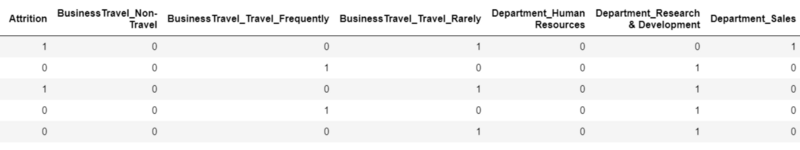

# Employee Attrition Repo

## INTRODUCTION
Every year a lot of companies hire a number of employees.The companies __invest__ time and money in __training__ those employees,not just this but there are __training programs__ within the companies for their existing employees as well. The aim of these programs is to __increase the effectiveness__ of their employees.
- But where __HR Analytics__fit in this?
_ and is it just about __improving__ the performance of employees?

## Data
| Column Name | Description |
| --- | --- |
| ‘Age’   | Numerical Value  |
| ‘Attrition’ | Employee leaving the company(0-no,1-yes)  |
| ‘Business Travel’ | (1- No Travel, 2- Travel Frequency,3- Trvael Rarely) |
| ‘Job Roll’ | (1- HC REP, 2- HR, 3- Lab Technician, 4- Manager, 5- Managing Director, 6- Research         Director, 7- Research Scientist, 8- Sales Executive ) |
| ‘Marital Status’ | (1-Single, 2- Married,3- Divorced) |
| ‘Gender’ | (1-Male, 2- Female) |

## Project Analysis
| Description | Analysis |
| --- | --- |
| hr_data.head |  |
| dummies |  |
| final |  |

### Feature Importance

- We saw how we can avoid using correlated values and why it is important not to use those while modelling.
- We used Random Forest

[Jupyter Notebook](./HR_Analytics.ipynb)
